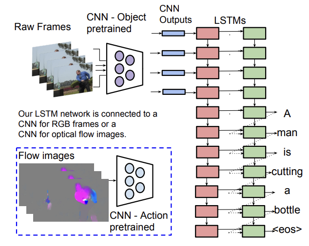

# Video Captioning

## 1. Introduction

Video captioning is the task of generating a textual description of a video. It is a challenging task that requires understanding of both the visual and the textual domain.
The task is similar to image captioning, but with the added complexity of temporal information.
The goal is to generate a coherent and informative description of the video content.

## 2. Dataset

As dataset the [Microsoft Research Video Description Corpus (MSVD)](https://www.kaggle.com/datasets/vtrnanh/msvd-dataset-corpus) is used.
It consists of 1970 YouTube video clips, each of which is accompanied by multiple English descriptions.

## 2. Architecture

The encoder-decoder architecture is an established approach for tackling sequence-to-sequence problems.
In the context of video captioning, a sequence of frames is fed into the encoder and the decoder generates a sequence of words.
Both encoder and decoder are implemented as [*Long Short Term Memory (LSTM)*](https://ieeexplore.ieee.org/abstract/document/6795963) layers.
LSTMs are a type of recurrent neural network that is capable of learning long-term dependencies.
This leads to better performance especially for longer sequences.

### 3.1. Feature Extraction

To reduce dimensionality and to extract relevant information from the input sequence, the pretrained CNN [VGG16](https://arxiv.org/abs/1409.1556) is used to output a fixed size feature vector for each frame.
These feature vectors are then fed into the encoder as input sequence.

### 3.2. Encoder

The encoder is responsible for extracting the relevant contextual information from the input sequence.
It is fed with a feature vectors representing video frames and generates a fixed-size representation of the input sequence acting as input for the decoder.

### 3.3. Decoder

The decoder is responsible for generating the output sequence.
The decoder-model for training and inference is slightly different.
During training, the decoder is fed with the ground truth sequence.
That means that the decoder is fed with the correct word at each time step no matter what the model has predicted before.
During inference, the decoder is fed with the predicted word from the previous time step simulating the real-world scenario.
One of the implications is that only the weights of the decoder model are saved and the connection has to be configured depending on the use case when loading the weights.
When using the model for inference there multiple ways to generate the output sequence.
The naive approach is to always take the word with the highest probability (greedy).
This is on my hardware the only applicable approach for real-time inference.
Another more sophisticated approach is to use beam search.
Beam search is a heuristic search algorithm that explores a graph by expanding the most promising word in a limited set of possible words (beam width).
This approach is computationally more expensive but can lead to better results as is commonly used in NLP.

## 4. Simplifications

To reduce the complexity of the model, the following simplifications have been made:
- restricting the number of frames per video to 80 (taken in equal intervals over the video)
- limiting the vocabulary to the 1500 most frequent words in the dataset
- restricting the length of the output sequence to be between 6 and 10 words

## 5. Result

In practice evaluating the performance of a text generation model is challenging as it is hard to quantify the quality of the generated text.
There are different metrics that can be used to measure the distance to the ground truth text.
However, in scope of this project, I decided to just manually verify the quality of the generated captions for some example clips.
The results are somewhat underwhelming.
The model performs well on videos of the dataset (seen data).
It also works when the clip is very similar to one of the training videos in terms of perspective and detail which seems to be a problem of the encoder.
As soon as the video is different from the training data, the model fails to generate meaningful captions.

There are several possible improvements that could be made to the model:
- using a larger number of frames per video
- handle stop words differently: They are necessary to generate a coherent sentence, but they don't carry much information and due to their high frequency in the dataset, they are overrepresented in the vocabulary
- increasing lower and upper bounds of the output sequence length to force the model to generate longer (potentially more informative) captions

## 6. Conclusion

While working on the project I learned a lot about the challenges of video captioning or sequence-to-sequence tasks in general.
I also saw the benefits pretrained models to preprocess the data and reduce dimensionality of the input.
I would've liked to tweak the model further and trying out some of my improvement ideas.
However, due to high training time of the model, this was not feasible in the scope of this project.
I will likely continue working on this project in the future probably equipped with better hardware and a deeper understanding of RNNs and their applications in NLP.

## 7. References

- [Sequence to Sequence -- Video to Text Paper](https://arxiv.org/abs/1505.00487)
- [Video Description Corpus](https://www.microsoft.com/en-us/research/project/msvd-video-description-corpus/)
- [LSTM](https://ieeexplore.ieee.org/abstract/document/6795963)
- [VGG16](https://arxiv.org/abs/1409.1556)

