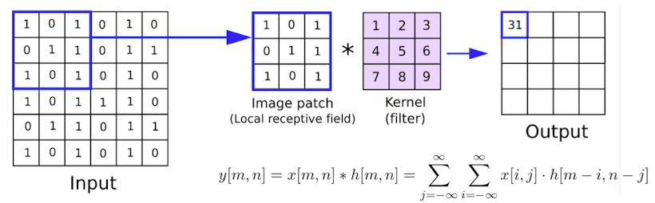
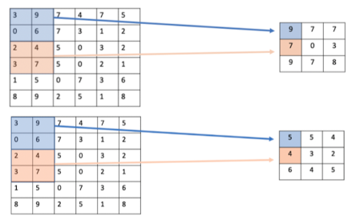
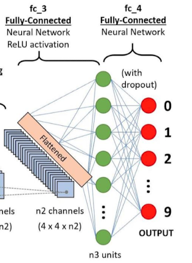
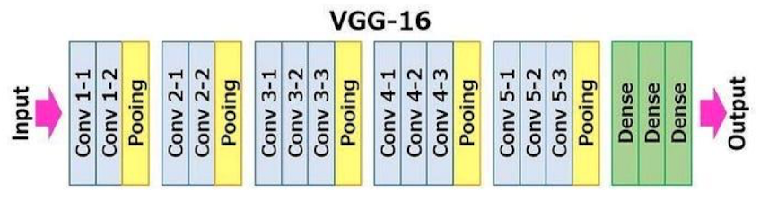
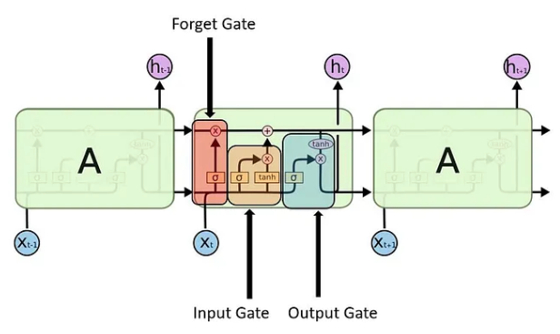
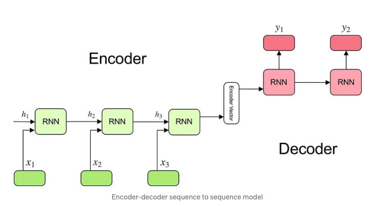
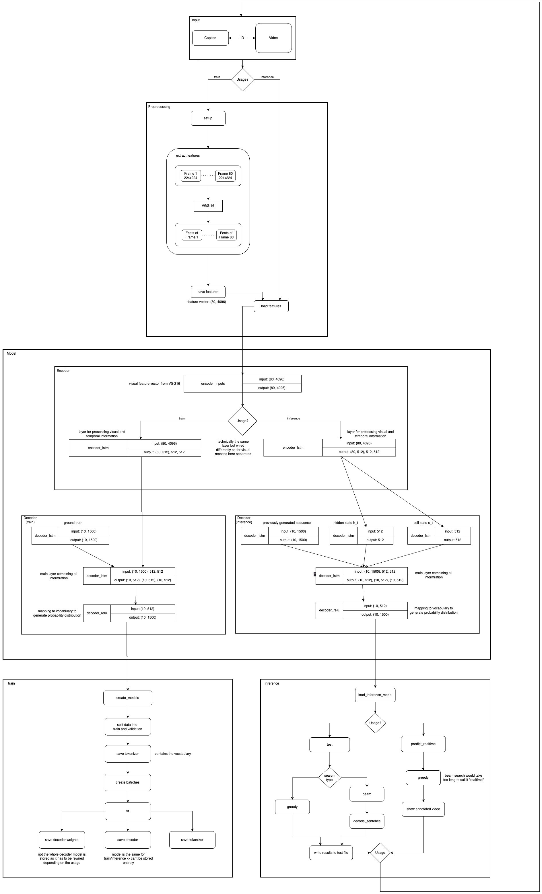

# Project Report: Video Captioning

Name: Simon Fliegel \
Matr.-Nr.: 53043 \
Course: I030 - Applied Artificial Intelligence \
Faculty: Mechanical Engineering / Robotics \
Date: 2025-03-27

## Table of Contents

1. [Introduction](#1-introduction)
    1. [Problem](#11-problem)
    2. [Motivation](#12-motivation)
    3. [Simplifications](#13-simplifications)
2. [Background](#2-background)
    1. [Convoluted Neural Networks (CNNs)](#21-convoluted-neural-networks-cnns)
        1. [Convolutional Layers](#211-convolutional-layers)
        2. [Pooling Layers](#212-pooling-layers)
        3. [Fully Connected Layers](#213-fully-connected-layers)
        4. [VGG16](#214-vgg16)
    2. [Long Short Term Memory (LSTM)](#22-long-short-term-memory-lstm)
        1. [Recurrent Neural Networks (RNNs)](#221-recurrent-neural-networks-rnns)
        2. [Vanishing Gradients](#222-vanishing-gradients)
        3. [Solution: LSTM](#223-solution-lstm)
            1. [Input gate](#input-gate)
            2. [Forget gate](#forget-gate)
            3. [Output gate](#output-gate)
    3. [Encoder-Decoder Architecture](#23-encoder-decoder-architecture)
        1. [Overview](#231-overview)
        2. [Difference between Training and Inference](#232-difference-between-training-and-inference)
3. [Methodology](#3-methodology)
    1. [Preprocessing](#31-preprocessing)
    2. [Training](#32-training)
    3. [Inference](#33-inference)
4. [Results](#4-results)
5. [Conclusion](#5-conclusion)
6. [References](#6-references)

## 1. Introduction

### 1.1. Problem

Video captioning is the task of generating a textual description of a video. It is a challenging task that requires understanding of both the visual and the textual domain.
The task is similar to image captioning, but with the added complexity of temporal information.
The goal is to generate a coherent and informative description of the video content.

### 1.2. Motivation

When I searched for a topic I wanted to do something focused on the architectural aspect of deep learning.
Due to recent popularity of LLMs I was interested in Transformers and their applications.
However, as we have neither them nor NLP in the lecture I decided to go with something less complex but still interesting.
I found the task of video captioning as it is intuitive and has a clear goal.
There also are profound datasets available for this task, like the [Microsoft Research Video Description Corpus (MSVD)](https://arxiv.org/abs/1505.00487) which I used for this project.
Technologically the combination of Computer Vision and NLP is also very interesting, especially the sequence-to-sequence nature of the problem requiring RNNs.
The goal of creating a coherent and informative description of a video hasn't really changed during the project.
However, I have made a few simplifications and assumptions to make the task more manageable.

### 1.3. Simplifications
- restricting the number of frames per video to 80 (taken in equal intervals over the video)
- limiting the vocabulary to the 1500 most frequent words in the dataset
- restricting the length of the output sequence to be between 6 and 10 words

These simplifications not only reduce the complexity of the problem but also make the training process more efficient.
This turned out to be crucial as the training process already took quite long to run on my hardware and made it difficult to experiment.

## 2. Background

In this project I used three main concepts which will be explained in the following sections.
All of them were combined to perform a pipeline for preprocessing, training and inference.

### 2.1. Convoluted Neural Networks (CNNs)

Convolutional Neural Networks are a type of neural network that is especially well suited for image processing tasks.
A typical CNN consists of three main types of layers: convolutional layers, pooling layers and fully connected layers.

#### 2.1.1. Convolutional Layers

Convolutional layers are the core building blocks of CNNs.
It works by sliding a filter (also called kernel) over the input image and computing the dot product of the filter and the input at each position.
This operation is called convolution and is the namesake of the layer.
The filter is learned and adapted during training to detect certain patterns in the input image.
The output of the convolutional layer is called feature map and represents the presence of certain patterns in the input image.

#### 2.1.2. Pooling Layers

Pooling layers are usually applied after a convolutional layer.
They reduce the spatial dimensions of the input volume and therefore the number of parameters and computation in the network.
This is to prevent overfitting and to make the network more computationally efficient.
The most common pooling operation is max pooling which takes the maximum value of a region of the input.
The operation is also applied by sliding a window over the input and taking the maximum value in case of max pooling or average value in case of average polling in each region.

#### 2.1.3. Fully Connected Layers

Fully connected layers are used to connect the output of the convolutional layers to the output layer.
This means they are at the end of the network and are responsible for making the final decision.
For this the output of the convolutional layers is flattened to a vector and fed into the fully connected layers.
This also eliminates the need for classifying the input into a fixed number of classes as the final layer can represent the desired output.
Often there is some dropout applied to the fully connected layers to prevent overfitting.

### 2.1.4. VGG16

In this project the pretrained CNN [VGG16](https://arxiv.org/abs/1409.1556) is used to extract features from the video frames.
It consists of 13 convolutional layers, 5 pooling layers and 3 fully connected layers.
The "16" refers to the number of trainable layers (layers with weights) in the network.
VGG16 has approximately 138 million parameters and is trained on the [ImageNet dataset](https://www.image-net.org/).
It is a popular choice for feature extraction due to its simplicity and good performance.
There are also larger CNNs like VGG19 or ResNet50 which have more layers and are more complex but also more computationally expensive.
As the CNN is only the first step in the pipeline and the other parts are already computationally expensive I decided that VGG16 would be sufficient.
I also think the quality of the features extracted by the majority of popular CNNs would be good enough and not the bottleneck of the project.

### 2.2. Long Short Term Memory (LSTM)

Long Short Term Memory networks are a type of recurrent neural network (RNN) that is capable of learning long-term dependencies.

#### 2.2.1. Recurrent Neural Networks (RNNs)

Recurrent neural networks are a type of neural network that is designed to handle sequential data.
They do this by maintaining a hidden state (h) that is updated at each time step and passed to the next time step. \
This state is calculated as follows:

$ h_t = f(W_{hh}h_{t-1} + W_{xh}x_t) $

Where 
- $ h_t $ is the hidden state at time t
- $ W_{hh} $ is the weight at previous hidden state
- $ W_{xh} $ is the weights at current input state
- $ f $ is the activation function

The hidden state $ h_t $ is then used to calculate the output state $ y_t $:

$ y_t = W_{hy}h_t $

Where
- $ y_t $ is the output state
- $ W_{hy} $ is the weight at the output state

The advantages of RNNs over regular neural networks are that they can handle sequential data of varying length. 
This makes them very flexible and suitable for a wide range of tasks.
However, RNNs still have difficulties learning long-term dependencies due to a problem called *vanishing gradients*.

#### 2.2.2. Vanishing Gradients

Vanishing gradients is the problem of greatly diverging gradient magnitudes between early and later layers encountered when training neural networks with backpropagation. (source: [Wikipedia](https://en.wikipedia.org/wiki/Vanishing_gradient_problem))
In context of RNNs this causes the network to forget information from the early time steps as the gradients become very small and the weights are barely updated.
To solve this problem, Long Short Term Memory networks were introduced.

#### 2.2.3. Solution: LSTM

LSTMs are a type of RNN that is capable of learning long-term dependencies.
They solve the vanishing gradient problem by introducing a memory cell, often referred to as $ c_t $, that can store information over long periods of time.

One could imagine the LSTM-cell to consist of two conveyor belts running parallel to each other. 

The LSTM cell consists of three gates which control the flow of information into and out of the cell:

##### Input gate

The input gates discovers which value from input should be used to modify the memory. 
The $ \sigma $-function decides which values to let through 0 and 1 being not important and important respectively.
A $ \tanh $-function gives weightage to the values which are passed deciding their level of importance ranging from $ -1 $ to $ 1 $.

$ i_t = \sigma(W_i \cdot [h_{t-1}, x_t] + b_i) $

$ \tilde{C}_t = \tanh(W_C \cdot [h_{t-1}, x_t] + b_C) $

##### Forget gate

The forget gate discovers what details to be discarded from the block.
It is decided by the $ \sigma $-function.
It looks at the previous state $ h_{t-1} $ and the input $ x_t $ and outputs a number between 0 and 1 for each number in the cell state $ C_{t-1} $.

$ f_t = \sigma(W_f \cdot [h_{t-1}, x_t] + b_f) $

##### Output gate

The input and the memory of the block is used to decide the output.
The $ \sigma $-function decides which values to let through 0,1.
The $ \tanh $-function gives weightage to the values which are passed deciding their level of importance ranging from $ -1 $ to $ 1 $ and multiplied with output of $ \sigma $.

$ o_t = \sigma(W_o \cdot [h_{t-1}, x_t] + b_o) $

$ h_t = o_t \cdot \tanh(C_t) $

Resource: [Colah's Blog](https://colah.github.io/posts/2015-08-Understanding-LSTMs/)

### 2.3. Encoder-Decoder Architecture

#### 2.3.1. Overview

The encoder-decoder architecture is an established approach for tackling sequence-to-sequence problems.
The idea is to use two separate RNNs, one for encoding the input sequence and one for decoding the output sequence.
The encoder processes the input sequence and generates a fixed-size vector of the input sequence.
At any time step, the encoder generates an output and a hidden state.
However, in my case only the output of the final time step is used as input for the decoder.
The decoder is fed with the output of the encoder and the sequence of previously generated tokens if any and generates a token at each time step.
In my case both encoder and decoder are implemented as LSTM layers.
The architecture has proven to be successful in NLP tasks like machine translation or text summarization and is sometimes referred to as the predecessor of transformers which are the core building blocks of any large language model (LLM) nowadays.

#### 2.3.2. Difference between Training and Inference

The decoder-model for training and inference is slightly different.
During training the docoder is always fed with the ground truth sequence.
This means that during training the output of the decoder is discarded at each time step.
This process is called *teacher forcing* and is done to prevent divergence of the model.
During inference there is of course no ground truth sequence available and the decoder is fed with its previous predictions at each time step.
There is room for optimization here as the decoder has to decide which token to choose based on a probability distribution.
Multiple seach algorithms can be applied here to enhance the performance of the model.
The most naive and computationally efficient approach is to always take the token with the highest probability but this can lead to worse results than with a more sophisticated approach like beam search.

## 3. Methodology

### 3.1. Preprocessing

I implemented the pipeline in the order of preprocessing, training and inference.
This means that my first step was to preprocess the data and extracting the visual features from the video frames using VGG16.
As VGG16 has a fixed input size of 224x224 pixels the preprocessing step was straightforward.
The second step was the selection of features I actually wanted to use. Here I made the first simplification by restricting the number of frames per video to 80 (following [this](https://arxiv.org/abs/1505.00487)) and choosing them in equal intervals over the video.
Making the selection of those frames more sophisticated would probably lead to better results but would require some prior knowledge about the video content increasing the complexity.

### 3.2. Training

The difficulties here were mainly setting up the encoder-decoder model and preparing the data for training.
Setting up the model to even compile was a challenge as the input and output shapes had to be carefully chosen.
For this I kept going back and forth between documentation and the code to improve my understanding.
I have to admit that I mostly used that understanding to make more profound prompts to Github-Copilot in order to develop an architecture step by step that would work.
To test this I ran a small training loop with a single batch to see if the model would compile and train without any errors.
This already leads to the second challenge of this part which was preparing the data for training.
The data consists of video frames and corresponding captions.
The video frames were already preprocessed but the captions had to be tokenized and padded to a fixed length.
Here I made the next simplifications to restrict the vocabulary to the 1500 most frequent words in the dataset and the length of the output sequence to be between 6 and 10 words.
This is a very naive approach and can be improved by filtering out stop words.
In general in the results stop words are over-represented in the current model and would need a different approach to be handled.
I created the vocabulary and tokenized the captions using the Keras Tokenizer.
The tokenizer holds a word$\rightarrow$index-mapping internally which can be used to convert words to indices and vice versa.

Now for the actual training I used a generator function (`yield`) to feed the data to the model in batches of 320.
To create the batches three types of data are needed:
1. the encoder inputs (extracted features from the video frames)
2. the decoder inputs (padded and tokenized captions) 
3. the decoder targets (shifted and padded captions)

During training, decoder inputs and targets are technically the same but shifted by one time step (ref. teacher forcing).
Of course the output of the encoder is also needed as input for the decoder but this is handled internally by the model as the output layer of the encoder actually is the input layer for the decoder.

### 3.3. Inference

The challenge for this step mainly was setting up the inference model with the slightly different architecture.
The architecture slightly changes as the decoder is now fed with its previous predictions at each time step.
The decoder inputs have to be rewired to the output of the previous time step instead of the ground truth sequence.
For this step Copilot also has been very helpful.
The changing nature of the decoder is also the reason why only the weights are saved and loaded and not the whole model as for the encoder model.
The second step was implementing an algorithm for choosing the next token based on the probability distribution.
I started naively implementing greedy search but also did some research on more sophisticated search algorithms for this purpose and stumbled accross beam search.
Beam search is popular for NLP tasks and is a heuristic search algorithm that explores a graph by expanding the most promising nodes and pruning the rest.
How many nodes are expanded is determined by the beam width parameter.
Last but not least I wanted a way to view the results of the model interactively so I implemented some "realtime" functionality to show the video and the generated captions side by side.
This step was mainly using OpenCV api to display the video and the captions.

## 4. Results

In practice evaluating the performance of a text generation model is challenging as it is hard to quantify the quality of the generated text.
There are different metrics that can be used to measure the distance to the ground truth text.
However, in scope of this project, I decided to just manually verify the quality of the generated captions for some example clips.
The results are somewhat underwhelming.
The model performs well on videos of the dataset (seen data).
It also works when the clip is very similar to one of the training videos in terms of perspective and detail which seems to be a problem of the encoder.
As soon as the video is different from the training data, the model fails to generate meaningful captions.

There are several possible improvements that could be made to the model:
- using a larger number of frames per video
- handle stop words differently: They are necessary to generate a coherent sentence, but they don't carry much information and due to their high frequency in the dataset, they are overrepresented in the vocabulary
- increasing lower and upper bounds of the output sequence length to force the model to generate longer (potentially more informative) captions

## 5. Conclusion

While working on the project I learned a lot about the challenges of video captioning or sequence-to-sequence tasks in general.
I also saw the benefits pretrained models to preprocess the data and reduce dimensionality of the input.
I would've liked to tweak the model further and trying out some of my improvement ideas.
However, due to high training time of the model, this was not feasible in the scope of this project.
I will likely continue working on this project in the future probably equipped with better hardware and a deeper understanding of RNNs and their applications in NLP.

## 6. References

- [Sequence to Sequence -- Video to Text Paper](https://arxiv.org/abs/1505.00487)
- [Video Description Corpus](https://www.microsoft.com/en-us/research/project/msvd-video-description-corpus/)
- Course Material
- [VGG16](https://arxiv.org/abs/1409.1556)
- [Medium Article on RNNs and LSTMs](https://colah.github.io/posts/2015-08-Understanding-LSTMs/)
- [Encoder-Decoder Architecture](https://medium.com/analytics-vidhya/encoders-decoders-sequence-to-sequence-architecture-5644efbb3392)
